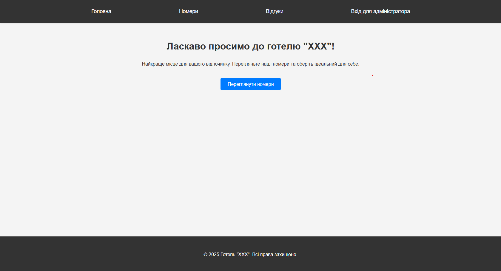
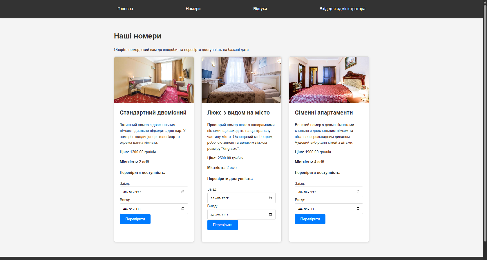
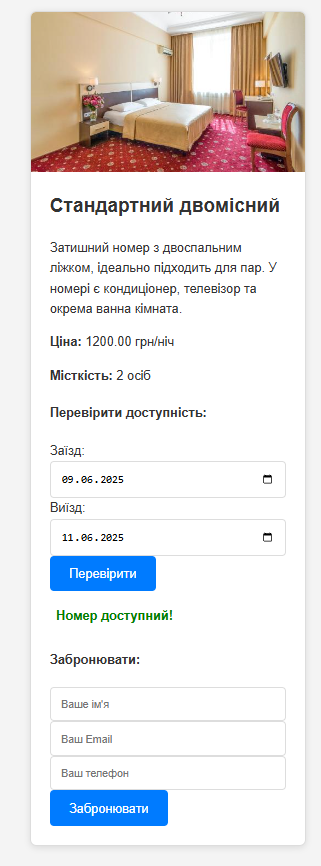
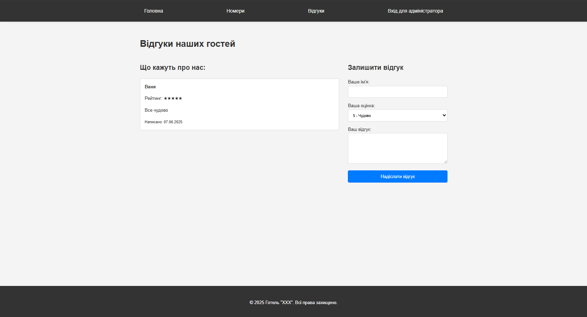
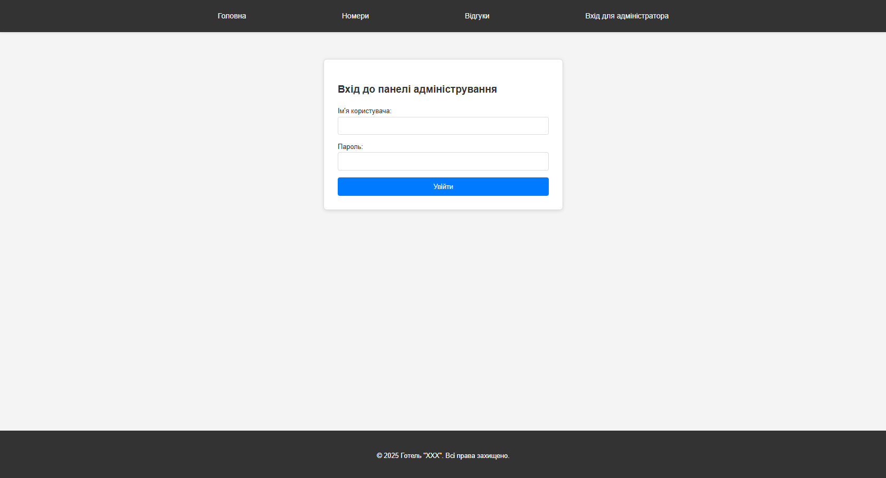
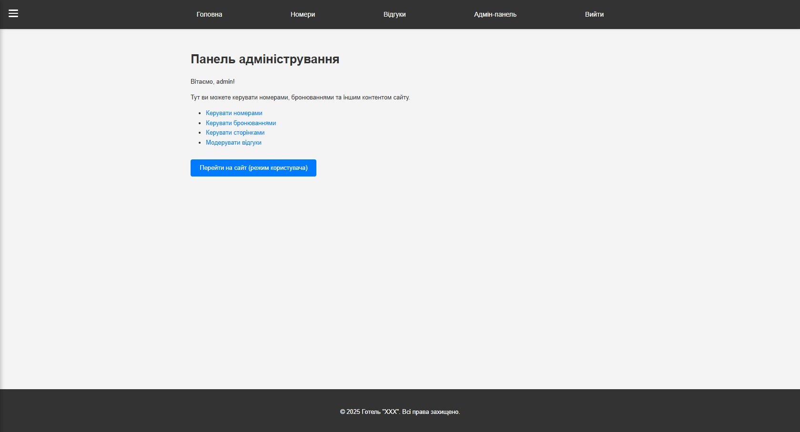
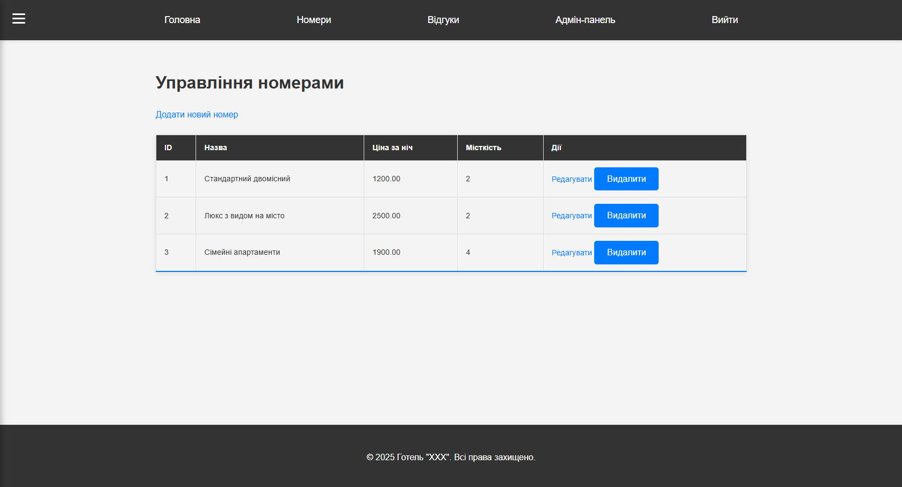
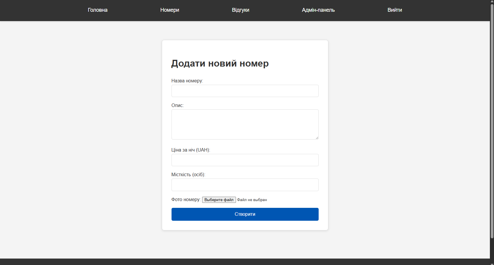
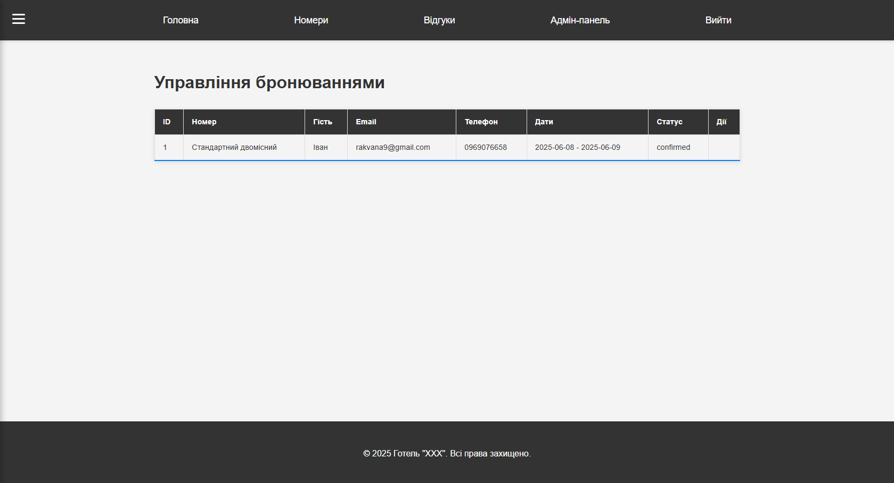
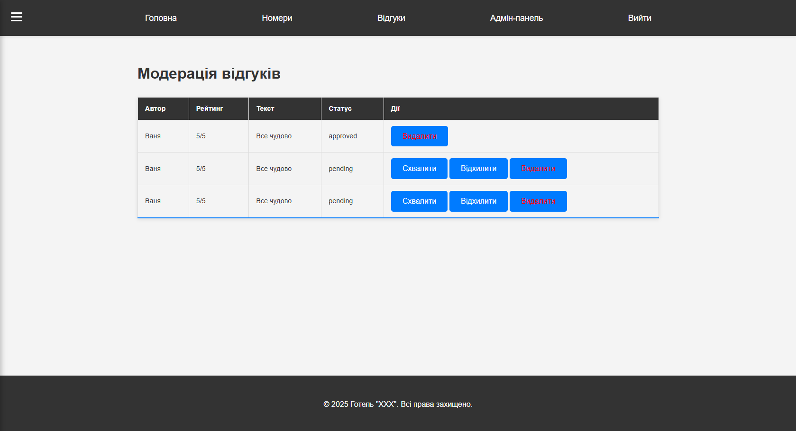

# Сайт бронювання готельних номерів на PHP

Це навчальний веб-проект, розроблений на чистому PHP з використанням об'єктно-орієнтованого підходу та архітектурного патерну MVC. Система дозволяє користувачам переглядати готельні номери, а адміністраторам — керувати контентом сайту.

---

## 📌 Опис функціоналу

### 🧭 Публічна частина

- **Головна сторінка**: Вітальна сторінка з посиланням на каталог номерів.
- **Каталог номерів**: Перелік доступних номерів, з описом, фото та цінами.
- **Асинхронна перевірка доступності**: AJAX-перевірка дати заїзду/виїзду без перезавантаження сторінки.
- **Бронювання**: Форма запиту при наявності вільного номера.
- **Відгуки**: Відображення схвалених відгуків та форма для надсилання нових на модерацію.

### 🔒 Адміністративна частина

- **Захищений доступ**: Вхід за логіном і паролем.
- **Панель керування**: Зручне бургер-меню з доступом до всіх модулів.
- **Керування номерами (CRUD)**: Додавання, редагування, видалення номерів.
- **Керування бронюваннями**: Підтвердження або скасування запитів.
- **Керування сторінками (CRUD)**: Публікація та чернетки.
- **Модерація відгуків**: Схвалення, відхилення або видалення.

---

## ⚙️ Технологічний стек

- **Серверна частина**: PHP 8 (ООП)
- **База даних**: MySQL
- **Клієнтська частина**: HTML5, CSS3, JavaScript (AJAX)
- **Веб-сервер**: Apache з `mod_rewrite`
- **Архітектура**: MVC (Model-View-Controller)

---

## 🚀 Запуск проекту локально

### 1. Передумови

- Встановлений WAMP/XAMPP/OpenServer
- PHP 8+ та MySQL
- Apache з увімкненим mod_rewrite
  
### 2. Налаштування БД запиті

- Створюємо базу даних hotel_booking з кодуванням utf8mb4_general_ci.
- Створюємо запити та виконуємо їх для створення таблиць для подальшої роботи з ними

### 3. Підключення БД до проекту 

- У файлі app/core/Database.php вказуємо інформацію для підключення БД:
  ```
    private string $host = 'localhost';
    private string $db_name = 'hotel_booking';
    private string $username = 'root';
    private string $password = '';
  ```

### 4. Конфігурація проекту 

- Відкриваємо файл app/config.php і встановлюємо:
```
define('BASE_URL', 'http://localhost/hotel-booking/');
```

### 5. Apache (.htaccess)

- Потрібно увімкнути mod_rewrite у Apache
- У файлі httpd.conf дозвольте переозначення:
```
AllowOverride All
```


# Принципи, патерни та техніки

## Programming Principles

- **SRP (Single Responsibility Principle):**  
  Кожен клас має одну відповідальність.

- **DRY (Don't Repeat Yourself):**  
  Шаблони `header.php`, `footer.php`, методи `view()`, `model()` — уникнення дублювання коду.

- **KISS (Keep It Simple, Stupid):**  
  Простий роутер (`app/core/Router.php`) для обробки маршрутів.

- **SoC (Separation of Concerns):**  
  Чітке розділення між `Model`, `View` та `Controller`.

- **Encapsulation:**  
  Закритий доступ до внутрішніх властивостей класів (через `private` / `protected`).

---

## Design Patterns

- **MVC (Model-View-Controller):**  
  Структура проєкту поділена на логічні компоненти:
  - **Model:** `app/models/Room.php`, `User.php`, тощо.
  - **View:** `app/views/...`
  - **Controller:** `app/controllers/...`

- **Front Controller:**  
  Всі запити проходять через `index.php`, який передає маршрут до `Router`.

- **Factory Method:**  
  Метод `model()` у `Controller.php` для динамічного створення моделей.

---

## Refactoring Techniques

- **Replace Magic String with Constant:**  
  Використання `ROOT`, `BASE_URL` замість жорстко прописаних шляхів.

- **Extract Partial/Template:**  
  Шаблони у `templates/` для повторюваного HTML.

- **Consolidate Conditional Expression:**  
  Наприклад, `if (!empty(...))` замість перевірок на порожні таблиці.

- **Introduce Parameter Object:**  
  Передача даних у вигляді масивів `$data` у методи створення/оновлення.

- **Simplify .htaccess logic:**  
  Один `.htaccess` → `index.php` → `Router` → Контролер.

---

## 📸 Скриншоти

Додавання скріншотів в папку `/screenshots`:

```markdown










```

### 👤 Автор
Рак Іван. ІПЗ-23-2.
